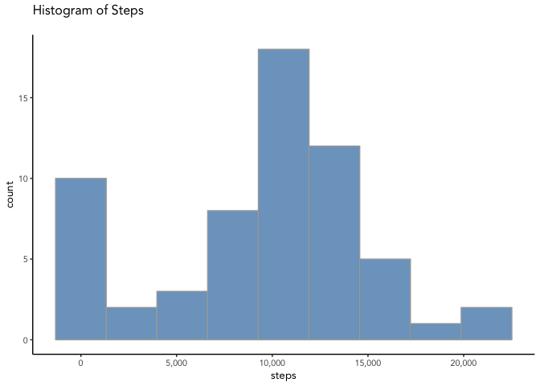
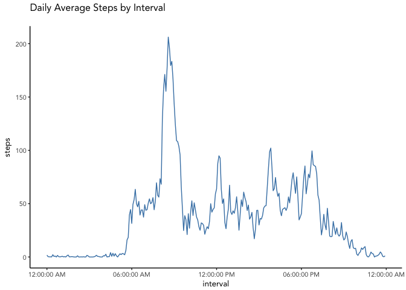
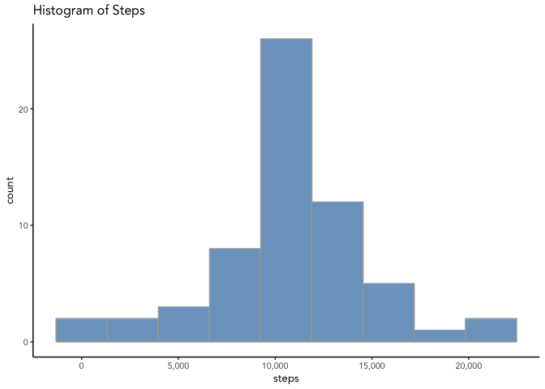
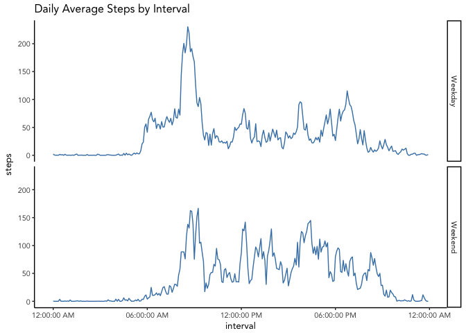

# Reproducible Research: Peer Assessment 1


## Loading and preprocessing the data

The following code chunk loads the necessary packages and processes the data so it can be useful while doing the analysis.  There is a section that loads the raw data, and makes two separate data sets for analysis, one at the date level, and one at the time level.  This processing also converts the interval from an integer that represents the 24 hour / 60 minute integer representation of interval into a time value.  This makes interpretation of the graphs more intuitive.


```r
# define libraries

library(readr)
library(dplyr)
library(ggplot2)
library(scales)

# unzip and load data

filename <- 'activity.zip'
unzip(filename)
data <- read_csv('activity.csv')

# Summarize Daily Data

dailyact <- data %>%
    group_by(date) %>%
    summarize(steps = sum(steps, na.rm = TRUE))

# Summarize Interval Data

minuteact <- data %>%
    group_by(interval) %>%
    summarise(steps = mean(steps, na.rm = TRUE))

# Convert interval to time to better display data

temp <- mapply(function(x, y) paste0(rep(x, y), collapse = ""), 0, 4 - nchar(minuteact$interval))
minuteact$interval <- paste0(temp, minuteact$interval)
minuteact$interval <- format(strptime(minuteact$interval, format="%H%M"), format = "%H:%M")
minuteact$interval <- paste('2017-01-01 ', minuteact$interval)
minuteact$interval <- as.POSIXct(minuteact$interval)
```

## What is mean total number of steps taken per day?

This section looks at frequency of step totals over the period in question.  The distribution is bimodal - we see peaks at 0 and at ~ 10,000 steps.  This is likely due to the missing values, which we will impute and fix in the next section to see how the distribution looks.


```r
# Create a histogram of steps per day

ggplot(aes(steps), data = dailyact) +
    geom_histogram(bins = 9, fill='steelblue', color='darkgrey', alpha = 0.75) + 
    theme_classic(base_family = 'Avenir', base_size = 10) + 
    scale_x_continuous(labels=comma) + 
    labs(title = 'Histogram of Steps\n')
```

<!-- -->

```r
# Calculate median steps per day

median(dailyact$steps, na.rm = TRUE)
```

```
## [1] 10395
```

```r
# Calculate mean steps per day

mean(dailyact$steps, na.rm = TRUE)
```

```
## [1] 9354.23
```

## What is the average daily activity pattern?

The activity pattern over the course of a day, on average, has a significant peak in the morning, with another peak around lunchtime (12:00), 3:00 pm, and 6:00 pm.  This is likely driven by work schedule.  In a later section we will separate the weekday and weekend and examine the pattern in isolation to see if there is a driver unique to the weekday/weekend split.


```r
# Create a plot of the average activity during the day and identify the
# most active interval during the day

ggplot(aes(interval, steps), data = minuteact) +
    geom_line(color = 'steelblue') +
    theme_classic(base_family = 'Avenir', base_size = 10) +
    scale_x_datetime(labels = date_format("%r", tz='EST')) +
    labs(title = 'Daily Average Steps by Interval\n')
```

<!-- -->

```r
format(minuteact$interval[which.max(minuteact$steps)], format = '%r')
```

```
## [1] "08:35:00 AM"
```

## Imputing missing values

This section uses a method to impute missing values in the original data set.  We have already gotten average step values by time interval from an earlier section.  We will make a copy of the original data set and then fill in the NAs with these average values by interval.  Once that is done, we will build a histogram to reexamine the distribution of values.  


```r
# Get copy of data

dataFixed <- data

# Fix times to match with minute interval data set

temp4 <- mapply(function(x, y) paste0(rep(x, y), collapse = ""), 0, 4 - nchar(dataFixed$interval))
dataFixed$interval <- paste0(temp4, dataFixed$interval)
dataFixed$interval <- format(strptime(dataFixed$interval, format="%H%M"), format = "%H:%M")
dataFixed$interval <- paste('2017-01-01 ', dataFixed$interval)
dataFixed$interval <- as.POSIXct(dataFixed$interval)

# Impute data

dataFixed$steps[is.na(dataFixed$steps)] <- minuteact$steps[match(dataFixed$interval[is.na(dataFixed$steps)],
                                                       minuteact$interval)]

# Summarize date data

dailyactFixed <- dataFixed %>%
    group_by(date) %>%
    summarize(steps = sum(steps, na.rm = TRUE))

# Summarize Interval Data

minuteactFixed <- dataFixed %>%
    group_by(interval) %>%
    summarise(steps = mean(steps, na.rm = TRUE))

# Convert interval to time


ggplot(aes(steps), data = dailyactFixed) +
    geom_histogram(bins = 9, fill='steelblue', color='darkgrey', alpha = 0.75) + 
    theme_classic(base_family = "Avenir", base_size = 10) +
    scale_x_continuous(labels=comma) + 
    labs(title = 'Histogram of Steps')
```

<!-- -->

```r
median(dailyactFixed$steps)
```

```
## [1] 10766.19
```

```r
mean(dailyactFixed$steps)
```

```
## [1] 10766.19
```

As we can see, the distribution appears more normal, and in fact, the mean and median are the same value, indicating a very centered distribution with not as much skewness as before.

## Are there differences in activity patterns between weekdays and weekends?

The graph below shows a very distinctive difference between the weekday and weekend activity pattern.  This is to be expected given the traditional workweek.  The weekday period shows a pronounced peak at around 8:00 am, followed by much smaller peaks at 12:00 pm, 3:00 pm, and 6:00 pm.  The weekend pattern is much more evenly distributed across the entire day, with no obvious time driven peak, except for, again, around 8:00 am, but not nearly as pronounced as the weekday peak.  Also, activity seems to begin later in the day, which might indicate a sleeping-in effect.


```r
Weekend <- as.vector(ifelse(weekdays(dataFixed$date) %in% c('Saturday', 'Sunday'), "Weekend", "Weekday"))
dataFixed <- cbind(dataFixed, Weekend)

WeekendActivity <- dataFixed %>%
    group_by(interval, Weekend) %>%
    summarise(steps = mean(steps, na.rm = TRUE))

ggplot(aes(interval, steps), data = WeekendActivity) +
    geom_line(color = 'steelblue') +
    facet_grid(Weekend ~ .) +
    theme_classic(base_family = "Avenir", base_size = 10) +
    scale_x_datetime(labels = date_format("%r", tz='EST')) +
    labs(title = 'Daily Average Steps by Interval')
```

<!-- -->

